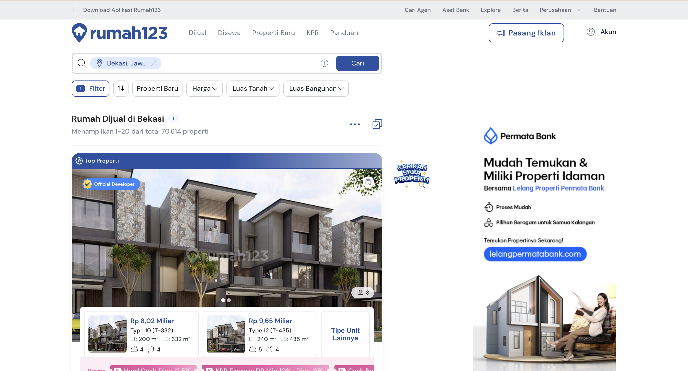
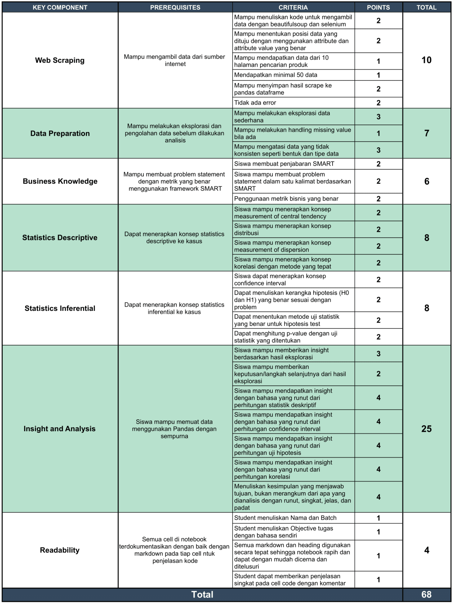

[](https://classroom.github.com/a/8dSTlMLX)
# Graded Challenge 3 - Set 2

_Graded Challenge ini dibuat guna mengevaluasi pembelajaran pada Hacktiv8 Data Science Fulltime Program khususnya pada konsep Web Scraping, Business Knowledge, dan Practical Statistics._

_version: GAIAv2.2_

_update date: 20250517_

---

## Objectives

*Graded Challenge 3* ini dibuat dengan tujuan sebagai berikut:

- Mampu melakukan Web Scraping dari sebuah website.

- Mampu melakukan Data Preparation sebelum proses analisis dilakukan.

- Mampu membangun Problem Statement dengan framework SMART sebagai salah satu langkah dalam Business Understanding.

- Mampu melakukan perhitungan statistik deskriptif.

- Mampu merumuskan hipotesis dan melakukan pengujian statistik.

- Mampu mengambil insight/informasi dari hasil perhitungan.

- Mampu mengambil kesimpulan yang menjawab Problem Statement.

---

## Problem

### Case

Anda ingin membeli rumah di Bekasi untuk tempat tinggal. Dengan banyaknya pilihan yang tersedia, Anda dapat mencari rumah yang sesuai dengan anggaran dan kebutuhan.

Anda menyadari bahwa data bisa membantu dalam membuat keputusan yang lebih baik. Oleh karena itu, Anda memutuskan untuk mengumpulkan dan menganalisa harga rumah di Bekasi berdasarkan data dari website Rumah123.

Tantangannya, Anda tidak memiliki data selain yang terpampang pada website Rumah123. Oleh karena itu, perjalanan Anda dimulai dari pengambilan data menggunakan Web Scraping !

#### A. Web Scraping

1. Lakukan pengambilan data dan filter untuk beli rumah di daerah "Bekasi". Anda bisa langsung akses link ini:

   https://www.rumah123.com/jual/bekasi/rumah/. 
  
   Berikut tampilan halaman link di atas:
   

2. Ambillah data mengenai : 
   - `Lokasi`, 
   - `Luas Tanah`, 
   - `Luas Bangunan`, 
   - `Carport`,
   - `Jumlah Kamar Tidur`, 
   - `Jumlah Kamar Mandi`, dan 
   - `Harga Rumah`.

3. Cermati masing-masing atrribute dan value tersebut berada dibagian mana dan sesuaikan method yang digunakan untuk mengambil hal-hal yang telah disebutkan sebelumnya. Misal apakah harus menggunakan `.find_next`, `.find_all`, `.find_next_sibling`, dst. 

4. Untuk memudahkan Anda, sudah disediakan list elemen salah satu rumah:
   ```html
   <!-- Harga rumah -->
   <div class="card-featured__middle-section__price"><strong>Rp 770 Juta</strong></div>

   <!-- Manfaatkan attribute sebelumnya untuk mengambil lokasi, cari tag a yang memiliki title dan href lalu cari attribute yang menyimpan lokasi-->
   <a title="Rumah Bagus dan Bebas Banjir  Di Bekasi Selatan" href="/properti/bekasi/hos19505931/" target="_self"><h2>Rumah Bagus dan Bebas Banjir  Di Bekasi Selatan</h2></a> <span>Jaka Mulya, Bekasi</span>

   <!-- Jumlah kamar tidur, kamar mandi, dan carport ditandai dengan icon untuk masing-masing nilai, sehingga Anda bisa memanfaatkan icon yang ada untuk mengambil nilai-nilai tersebut -->
   <use xlink:href="#rui-icon-bed-small" fill="#677E8C"></use> <span class="attribute-text">2</span>
   <use xlink:href="#rui-icon-bath-small" fill="#677E8C"></use> <span class="attribute-text">1</span>
   <use xlink:href="#rui-icon-car-small" fill="#677E8C"></use> <span class="attribute-text">1</span>

   <!-- Luas Tanah -->
   <div class="attribute-info">LT : <span>300 m²</span></div>

   <!-- Luas Bangunan -->
   <div class="attribute-info">LB : <span>45 m²</span></div>
   ```
  
   **WARNING:** Anda harus mengecek lagi kebenaran dari elemen tersebut karena Rumah123 merupakan website dinamis yang bisa saja berubah lagi attribute dan value-nya. Pastikan kembali mengenai seluruh attribute dan value yang digunakan saat melakukan Web Scraping dengan Beautifulsoup.

5. Ambil informasi rumah minimal 10 halaman (perhatikan format URL yang digunakan dan lakukanlah eksplorasi terlebih dahulu halaman web-nya).

6. Perlu diingat bahwa setiap orang dan waktu ketika melakukan scraping dapat menghasilkan hasil data yang berbeda. Hal ini tidaklah menjadi masalah. Pastikan jumlah data yang diperoleh minimal 100 data dari minimal 10 halaman yang diakses.

7. Simpan hasil scraping ini ke Pandas DataFrame dan lakukanlah pengolahan terhadapnya sesuai dengan instruksi selanjutnya dibawah ini. Anda dibebaskan memberikan nama kolom yang memudahkan Anda.

#### B. Data Preparation

1. Lakukan eksplorasi data sederhana dibawah ini :
   - Tampilkan beberapa baris data dan tuliskan insight-nya.
   - Tampilkan informasi rangkuman data dan tuliskan insight-nya. Berikan juga penjelasan mengenai langkah apa yang akan Anda lakukan.
   - Cek Missing Value dan tuliskan insight dari temuan yang Anda dapatkan.

2. Lakukan Data Cleaning dibawah ini : 
   - Handling Missing Value bila ada.
   - Mengubah bentuk data agar menjadi lebih konsisten.
   - Menyesuaikan tipe data. 
    
   Perlu diingat bahwa data ini akan digunakan untuk perhitungan statisik dan membutuhkan kolom dengan tipe data angka.

3. Catatan:
   - Pada kolom `Harga Rumah`, ada beberapa harga rumah yang mempunyai promo ditandai dengan kata `HEMAT`. Ambil harga setelah didiskon yaitu di kata pertama. Misal `Rp 1,2 MiliarRp 1.3MHEMAT 100 Jutaan`, maka ambil yang `Rp 1,2 Miilar`.
   - Ubah format penulisan `Harga Rumah` ke dalam jutaan dan hilangkan simbol mata uang. Misal `Rp 1,6 Miliar` -> `1600` dan `Rp 600 Juta` -> `600`.
   - Pada kolom `Lokasi`, lokasi rumah dituliskan dengan format `Nama Area, Bekasi`. Hapus kata `, Bekasi` dan sisakan nama area.
   - Pada kolom `Luas Tanah` dan `Luas Bangunan`, hapus satuan yang ada didalam kolom tersebut.
   - Pada kolom `Carport`, terdapat missing value yang berarti rumah tersebut tidak memiliki carport sehingga ganti dengan nilai `0`.

#### C. Business Understanding/Problem Statement

Buatlah Problem Statement menggunakan SMART framework (berikut dengan penjabaran Specific, Measurable, Achievable, Relevant, dan Time-bound). Buatlah Problem Statement ke dalam satu kalimat dan gunakan metrik yang tepat pada kasus ini.

#### D. Analysis

Dalam melakukan analisa data untuk mencapai tujuan yang diinginkan, Anda perlu mengikuti soal/pertanyaan/instruksi berikut ini :

1. Hitung rata-rata, median, standar deviasi, skewness, dan kurtosis dari semua kolom numerik. Dari hasil perhitungan, insight apa saja yang bisa Anda dapatkan (seperti distribusi data, kecenderungan ada/tidaknya outlier, dll)?

   > *Note : Jika menemukan adanya indikasi outlier dari perhitungan ini, tidak perlu di-handle karena sifatnya alami. Dibiarkan saja.*

2. Anda perlu mempersiapkan uang untuk pembelian rumah ini sehingga Anda harus mengetahui berapa kisaran harga rumah yang wajar di Bekasi ? 
   > *Gunakan confidence interval untuk mendapatkan lower value dan upper value dari distribusi populasi harga rumah.
   > *Gunakan confidence level 95%.*

3. Saat ini Anda belum memiliki mobil sehingga `Carport` bukan prioritas saat ini. Anda mau tahu apakah rumah dengan `Carport` lebih mahal dibandingkan tanpa `Carport`. Berikan analisa apakah layak membayar lebih untuk rumah yang memiliki `Carport`? 

   > *Gunakan uji hipotesis yang diawali dengan menuliskan hipotesis null dan alternatifnya serta tentukan jenis hipotesis yang digunakan.*

4. Jika harus memilih, apakah Anda lebih baik membeli tanah yang luas ataukah membeli bangunan yang luas ? Manakah yang lebih mempengaruhi harga rumah, apakah `Luas Tanah` ataukah `Luas Bangunan` ? Berikan pendapatmu. 
   
     > *Anda dapat jawab pertanyaan ini dengan uji korelasi. Gunakan library SciPy (bukan Pandas). Analisis nilai korelasi dan p-value nya. Gunakan teknik yang sesuai dengan kondisi data !*

Anda dilarang untuk menyalin pertanyaan soal. Buatlah cerita yang runut dari persoalan dan jawaban nomor 1 sampai 4 sebagai ganti kalimat soal.

#### E. Conclusion

Tuliskan **Kesimpulan** dalam bentuk markdown dari hasil analisis nomor 1-4. Kesimpulan yang baik menjawab tujuan yang ingin dicapai. Anda dibebaskan menuliskan dalam format paragraf atau poin.

---

## Instructions

*Graded Challenge 3* dikerjakan dalam format ***Python Notebook (.ipynb)***  dengan beberapa **kriteria wajib** dibawah ini:

1. *Project* dinyatakan selesai dan diterima untuk dinilai jika notebook dapat dijalankan seluruhnya tanpa ada error.

2. Pada tugas Graded Challenge 3, Anda akan diminta untuk membuat sebuah **Notebook (.ipynb)** yang berisikan pengambilan, pengolahan, dan analisis data. Kerjakanlah dengan Visual Studio Code !

3. Notebook **wajib** diberikan keterangan atau pengenalan dengan menggunakan `comment` atau `docstring` yang berisikan Judul tugas, Nama, Batch, dan penjelasan singkat tentang program yang dibuat, fitur-fitur. Contoh:
    ```py
    '''
    =================================================
    Graded Challenge 3

    Nama  : Fahmi Iman Alfarizki
    Batch : BSD-50

    Program ini dibuat untuk melakukan automatisasi pengolahan (cleaning) data text yang berguna untuk pemodelan model analisa sentimen.
    =================================================
    '''
    ```

5. Berikan penjelasan pada setiap cell di notebook mengenai apa yang dilakukan/dijalankan dengan menggunakan markdown.

6. **WARNING**: Plagiarisme sekecil apapun dapat terdeteksi. Tugas ini akan diuji tingkat plagiarismenya dengan software khusus.

---

## Submission

- Simpan assignment Graded Challenge 3 ini dengan format `P0G3_<nama-student>.ipynb`. Misal : `P0G3_fahmi_iman.ipynb`.

- Upload juga data hasil proses scraping ke dalam repository dengan format `P0G3_data_<nama-student>.csv`. Misal : `P0G3_data_fahmi_iman.csv`.
  
- Push Assignment yang telah Anda buat ke repository tugas GitHub Classroom Anda.

- Contoh bentuk repository :
   ```
   P0-GC3-Set-2/fahmi-iman
   |
   ├── P0G3_data_fahmi_iman.csv
   ├── P0G3_fahmi_iman.ipynb
   ├── README.md
   └── /images
         ├── assignment-rubrics.png
         └── search-results-page.png
   ```

---

## Rubrics



---

## Notes

* **Deadline : pukul 23:59 WIB.**

* **Keterlambatan pengumpulan tugas mengakibatkan skor GC 3 menjadi 0.**
